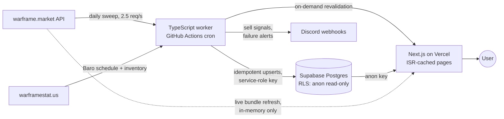

# Ducat2Plat


A market-arbitrage engine for Warframe's player economy. It ingests
[warframe.market](https://warframe.market) trade data daily, accumulates a price
archive that outlives the API's own 90-day window, and turns it into actionable
answers: *what junk to buy, from whom, at what price, and when to sell what you
bought.*

**Live:** https://ducat2-plat.vercel.app

## The problem

Warframe has a two-currency arbitrage loop: players buy unwanted "Prime junk"
with platinum (the tradeable premium currency), convert it to ducats at a fixed
rate, and spend ducats at **Baro Ki'Teer** — a merchant who visits for 48 hours
every two weeks selling items that resell for platinum. Profit exists, but it
hides behind real market friction:

- **Listings are not prices.** The lowest ask is a fantasy the moment you buy
  more than one unit — real cost means walking up the order book.
- **The unit of action is the trade, not the item.** Daily trades are capped by
  player rank and each trade carries at most 6 items, so *profit per trade slot*
  beats profit per item.
- **Prices are regime-dependent.** A merchant restock floods supply and crashes
  prices on a schedule; annual events crash the entire market at once. A naive
  moving average happily averages across a cliff.

Ducat2Plat is a single-operator tool built to respect all three.

## What it does

| Surface | Answer it gives |
|---|---|
| **Bundles** (landing) | Sellers offering multiple wanted items — whole baskets bought in one trade, with one-click whisper copy. A **live refresh** re-checks the order books on demand, because specific listings go stale in hours. |
| **Ranking** | Depth-aware price reference: `PpD@6` = the ducats-per-plat you *actually* get buying six units from real listings, plus a per-tier price guide for bulk "WTB junk" buying. |
| **Baro** | A hold advisor for merchant visits: BUY & FLIP / BUY & HOLD (~N days) / SKIP verdicts from each item's own restock-recovery history, plus a visit-level verdict ("worth spending ducats?") and a between-visits recovery watchlist. |
| **Positions** | Records what you bought at what effective cost, marks it to market daily, and pushes Discord sell alerts when a target is hit, the recovery window elapses, or the item gets restocked (supply incoming — sell now). |

## Architecture



No always-on server. The worker runs on a schedule, pages are statically cached
and revalidated the moment new data lands, and the one "live" feature fetches
on demand inside a single serverless function without persisting anything.
Total infrastructure cost: **$0** (free tiers, used deliberately).

## Technical decisions worth reading

**Closed trades over listings.** The analytical backbone is warframe.market's
*closed-trade* statistics (real fills), not order-book snapshots (asks). This
one choice eliminated a whole class of planned complexity — high-frequency
snapshotting was rejected as a non-goal in the spec before a line was written.

**The archive is the product.** The upstream API serves a rolling ~90 days;
this system's Postgres archive grows past that horizon daily. Every
forecast-ish feature (recovery curves, baseline drift) is designed to sharpen
automatically as the archive accumulates — data advantage as a moat, on a free
tier that the size math says will last years.

**Batch cadence matched to the economy.** Ducat economics move in days, so
ingestion is one daily sweep — with one evidence-driven amendment: the merchant
lands ~13:00 UTC Fridays and a 06:00-only schedule left the advisor blind for
17 of his 48 hours, so visit Fridays get a second scheduled run. Still batch,
never reactive.

**Freshness where it matters, archival where it doesn't.** Specific listings
decay in hours even though prices don't. The live-bundles endpoint re-fetches
~60 order books (serially, rate-limited, ~20s) and computes bundles *in
memory* — zero database writes, so the archival design stays pure while the
"about to trade" moment gets 30-second-old truth. Client-side cooldown plus a
server backstop keep it a polite API citizen.

**Compute once, serve cached.** The worker precomputes rankings into a table
after each sweep; pages are ISR-cached and the sweep's last step calls an
on-demand revalidation route. The database sees one computation per day instead
of one per page view.

**Torn-sweep protection.** Every ingestion run is a `sweeps` row; the dashboard
only ever reads data belonging to the latest run with `completed_at IS NOT
NULL`. A sweep that dies at item 230/600 can never half-update what users see —
the previous complete snapshot keeps serving.

**One source of truth for the money-math.** All financial formulas live in
`shared/metrics.ts` as pure functions. The web app consumes a *generated,
committed copy* (build-tooling constraints prevent cross-root imports on the
deploy platform), kept honest by a CI test that fails on a single byte of
drift. Same functions, same numbers, in the worker's Discord alerts and the UI.

**Transparent statistics, no ML.** Recovery estimates come from pooled median
curves over each item's own restock events, with maturity gates: an item gets a
per-item curve only at n ≥ 3 observed restocks, and the UI *always shows the
sample size*. Below threshold it says "insufficient history" rather than
fabricating precision. Regime events (vaultings, full-catalog floods) are
stored as first-class data and drawn on every chart instead of being smoothed
over.

**Security model.** The service-role key exists only in the worker's CI
secrets; the web app uses an anon key against row-level-security read-only
policies. Write access (position tracking) is gated by a token that lives
exclusively in the operator's browser localStorage — a design forced by a real
lesson: a secret passed as a server-component prop serializes into the page
payload and caches. Found it, redesigned it, rotated it.

## Testing

- **160+ unit tests**, concentrated where money is computed: order-book
  walking across quantity boundaries, junk-rate medians, ROI signs,
  sell-signal dedup, recovery-curve extraction — including regression tests
  for every real bug this project has shipped and fixed.
- **A synthetic dev world** (`worker/scripts/seed-synthetic.ts`): a
  deterministic fake market with *known* ground truth ("mod S3 recovers in
  exactly 21 days, n=4") so the full pipeline can be asserted end-to-end, and
  mature code paths could be exercised months before real data existed. A
  `dev_marker` interlock makes it impossible to point at production.
- **Zod at every boundary**: third-party API payloads are schema-validated;
  a malformed response is logged and skipped, never written.
- **A data-quality gate** inside the sweep: ducat values in the legal set,
  medians positive, row counts within band of the previous run — violations
  alert to Discord before the sweep closes.

## Failure stories this project earned

The recurring theme of this codebase's history is **silent failure**, and its
countermeasures are the most transferable thing in it:

- A backup job was green for weeks while producing **174-byte empty dumps** —
  `pg_dump | gzip` returns gzip's exit code. Now: `pipefail`, dump-to-file, and
  a hard failure if the output is under 10 KB.
- An entire test suite (105 tests) **never ran in CI** — it sat outside the
  test runner's default include glob. Caught by noticing a pass-count that
  didn't move; now explicitly included.
- A feature shipped with its **database migration never applied** — every
  layer swallowed the missing-table error into an empty state.
- CI failed on every push while all checks passed locally: **npm major
  versions disagree** about lockfile format. Fixed by pinning the exact npm
  version in CI to match the one that writes the lockfiles.
- PostgREST **silently caps queries at 1000 rows** — charts showed 17 days of
  a 90-day archive. Every bulk read now goes through a pagination helper with
  deterministic ordering.

Each one produced a test, a guard, or an alert. Green checkmarks are claims,
not facts.

## Repository layout

```
/web        Next.js app (App Router, ISR, Tailwind, Recharts)
/worker     TypeScript ingestion worker + scripts (runs in GitHub Actions)
/shared     Pure metric functions (single source of the money-math) + tests
/supabase   Numbered SQL migrations
/docs       Operations runbook
SPEC.md     Build specification — the architectural decisions and non-goals
ROADMAP.md  Milestones M7–M14 with acceptance criteria
```

The project was built spec-first: `SPEC.md` froze the architecture and
explicit non-goals before implementation, and every milestone in `ROADMAP.md`
carries acceptance criteria that were verified against live data — several of
which caught bugs the test suite alone did not.

## Running it yourself

```bash
# Dashboard
cd web && npm ci && npm run dev

# One ingestion sweep (needs a Supabase project + .env.local with
# SUPABASE_URL and SUPABASE_SERVICE_ROLE_KEY; apply /supabase migrations first)
cd worker && npm ci && npm run sweep

# Tests
cd worker && npx vitest run   # includes shared metric tests
cd web && npx vitest run
```

Environment variables, alerting setup, backup/restore, and the operational
runbook live in [`docs/RUNBOOK.md`](docs/RUNBOOK.md).

## Disclaimer

Fan-made tool. Not affiliated with Digital Extremes. Market data courtesy of
[warframe.market](https://warframe.market)'s public API, accessed read-only at
a polite rate with an identifying User-Agent. The tool automates *analysis
only* — every trade is executed manually by a human, per the game's terms.
