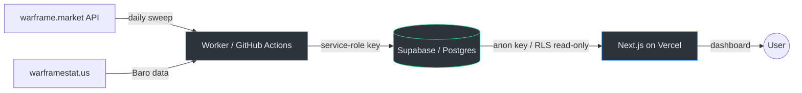

# Ducat2Plat

Plat-per-Ducat arbitrage dashboard for Warframe. Ranks Prime junk by actionable
PpD@6, tracks Baro Ki'Teer item ROI, and surfaces seller bundles for
trade-slot-efficient buying.

**Production:** <!-- TODO: replace with your Vercel URL --> `https://your-app.vercel.app`

## Architecture



| Component | Location | Runs on |
|-----------|----------|---------|
| Ingestion worker | `/worker` | GitHub Actions (daily cron) |
| Dashboard | `/web` | Vercel (Next.js App Router) |
| Database | Supabase | Postgres (free tier) |
| Backups | `.github/workflows/backup.yml` | GitHub Actions (weekly cron) |

## Environment variables

### Vercel (web)

Set these in the Vercel dashboard for **all environments** (Production, Preview, Development):

| Variable | Value |
|----------|-------|
| `NEXT_PUBLIC_SUPABASE_URL` | Your Supabase project URL |
| `NEXT_PUBLIC_SUPABASE_ANON_KEY` | Your Supabase anon/public key |

**Never** set `SUPABASE_SERVICE_ROLE_KEY` in Vercel — the dashboard uses the
anon key with RLS read-only policies.

### GitHub Actions (worker + backup)

Set these as repository secrets in Settings > Secrets and variables > Actions:

| Secret | Used by |
|--------|---------|
| `SUPABASE_URL` | sweep workflow |
| `SUPABASE_SERVICE_ROLE_KEY` | sweep workflow |
| `SUPABASE_DB_URL` | backup workflow (`postgresql://...`) |
| `DISCORD_WEBHOOK_URL` | sweep + backup failure alerts |

---

## Runbook

### Sweep failed — diagnosis steps

1. **Check the Discord alert.** The alert links directly to the failed Actions run.
2. **Read the Actions log.** Look for which step failed:
   - `Install dependencies` — usually a transient npm registry error; re-run.
   - `Run sweep` — check the detailed log output for the root cause:
     - `429`/`503` errors with backoff exhausted → warframe.market is down or
       rate-limiting harder than usual. Wait and re-run.
     - `Missing SUPABASE_URL` → secrets misconfigured.
     - `NOT completed: N% success` → too many individual item failures; the
       sweep did not close. The previous complete sweep's data is still served.
3. **Check the `sweeps` table.** Look for the most recent row:
   ```sql
   SELECT id, started_at, completed_at, items_ok, items_failed, notes
   FROM sweeps ORDER BY id DESC LIMIT 5;
   ```
   - `completed_at IS NULL` → the sweep crashed or was below the 90% threshold.
   - High `items_failed` → warframe.market may have changed an API response shape.
4. **Check the `heartbeat` table:**
   ```sql
   SELECT updated_at, last_sweep_id FROM heartbeat WHERE id = 1;
   ```
   If `updated_at` is more than 36 hours old, the dashboard shows a staleness banner.

### Manual re-run via workflow_dispatch

1. Go to **Actions** > **Daily Sweep** > **Run workflow** > select `main` branch > **Run**.
2. The concurrency group prevents overlapping runs.

### Degraded sweep

A "degraded sweep" alert means the sweep completed but >10% of items failed.
The data is still served (the sweep closed), but coverage is reduced. Check the
Actions log for which items failed and why — usually a transient API issue that
resolves on the next run.

### Backup restore procedure

**Prerequisites:** a fresh Supabase project (or your existing one if replacing data),
and the `psql` client installed locally.

1. **Download the backup artifact** from GitHub Actions > Weekly Backup > select
   the run > download the `db-backup-YYYY-MM-DD` artifact (a `.sql.gz` file).

2. **Decompress:**
   ```bash
   gunzip backup-2025-01-15.sql.gz
   ```

3. **Restore into the target project:**
   ```bash
   psql "$NEW_SUPABASE_DB_URL" < backup-2025-01-15.sql
   ```
   Where `$NEW_SUPABASE_DB_URL` is the connection string of the target Supabase
   project (Settings > Database > Connection string > URI).

4. **Re-point environment variables:**
   - Update `SUPABASE_URL` and `SUPABASE_SERVICE_ROLE_KEY` in GitHub Actions
     secrets to the new project's values.
   - Update `SUPABASE_DB_URL` in GitHub Actions secrets.
   - Update `NEXT_PUBLIC_SUPABASE_URL` and `NEXT_PUBLIC_SUPABASE_ANON_KEY` in
     Vercel dashboard to the new project's values.
   - Redeploy the Vercel app (Settings > Deployments > Redeploy).

5. **Verify:**
   - Run a manual sweep via workflow_dispatch.
   - Check the dashboard loads and shows fresh data.

### Key rotation

**Supabase anon key:**
1. Regenerate in Supabase Dashboard > Settings > API.
2. Update `NEXT_PUBLIC_SUPABASE_ANON_KEY` in Vercel for all environments.
3. Redeploy the Vercel app.

**Supabase service-role key:**
1. Regenerate in Supabase Dashboard > Settings > API.
2. Update `SUPABASE_SERVICE_ROLE_KEY` in GitHub Actions secrets.
3. Run a manual sweep to verify.

**Supabase database password (affects DB URL):**
1. Reset in Supabase Dashboard > Settings > Database.
2. Update `SUPABASE_DB_URL` in GitHub Actions secrets with the new connection string.
3. Run a manual backup to verify.

**Discord webhook URL:**
1. Create a new webhook in your Discord server > channel settings > Integrations.
2. Update `DISCORD_WEBHOOK_URL` in GitHub Actions secrets.
3. Optionally delete the old webhook in Discord.
